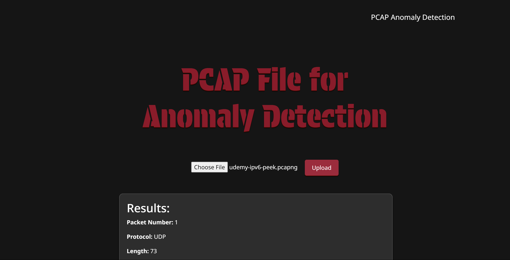

# PCAP Anomaly Detection

## Description
A web application for analyzing packet capture (PCAP) data using a Cumulative Distribution Function (CDF) to detect anomalies. This tool aims to protect network traffic by identifying unusual packet lengths and potential anomalies through statistical analysis.

  </video>

## Features

- **File Upload and Analysis:** Allows users to upload PCAP files for packet anomaly detection.
- **Statistical Analysis:** Uses the Cumulative Distribution Function (CDF) to compute the probability that a packet length is less than or equal to a specific value.
- **Backend Integration:** Implements the anomaly detection solution using Flask.

## Usage

To run the app locally, follow these steps:

1. Clone this repository to your local machine.
2. Install the required dependencies.
3. Run the Flask project by typing `python app.py`

## Dependencies

- Flask

Angela Samboa 2024

